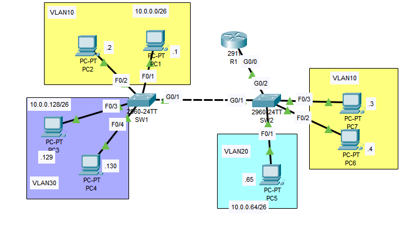

# Cisco Packet Tracer Lab: VLAN and Inter-VLAN Routing

## Overview

This lab demonstrates the configuration of VLANs, trunking between switches, and inter-VLAN routing using the **router on a stick** method in a network consisting of multiple PCs, switches, and a router. The goal is to achieve connectivity between different VLANs and ensure proper network segmentation.

## Objectives

1. **Configure Switch Interfaces**:
   - Configure the switch interfaces connected to the PCs as access ports in their respective VLANs.

2. **Trunk Configuration**:
   - Configure the connection between SW1 and SW2 as a trunk link.
   - Only allow necessary VLANs on the trunk link.
   - Configure an unused VLAN as the native VLAN.
   - Ensure that all necessary VLANs exist on both switches.

3. **Router on a Stick**:
   - Configure the connection between SW2 and R1 using the router-on-a-stick method.
   - Assign the last usable address of each subnet to R1's subinterfaces.

4. **Connectivity Testing**:
   - Ensure all PCs can ping each other to verify proper configuration and connectivity.

## Network Diagram



## VLAN Configuration

### Switch 1 (SW1)
- **PC1 & PC2**: VLAN 10
- **PC3 & PC4**: VLAN 30

### Switch 2 (SW2)
- **PC5**: VLAN 20
- **PC6 & PC7**: VLAN 10

## Configuration Steps

### 1. Configure Access Ports on Switches

On **SW1**, configure the interfaces connected to PCs as access ports in the correct VLANs:

```bash
SW1(config)# interface range fa0/1 - 2
SW1(config-if-range)# switchport mode access
SW1(config-if-range)# switchport access vlan 10

SW1(config)# interface range fa0/3 - 4
SW1(config-if-range)# switchport mode access
SW1(config-if-range)# switchport access vlan 30
```
On **SW2**, configure the access ports:
```bash
SW2(config)# interface range fa0/1
SW2(config-if)# switchport mode access
SW2(config-if)# switchport access vlan 20

SW2(config)# interface range fa0/2 - 3
SW2(config-if-range)# switchport mode access
SW2(config-if-range)# switchport access vlan 10
```
### 2. Configure Trunk Link Between SW1 and SW2
To allow communication between VLANs on both switches, configure the link between SW1 and SW2 as a trunk:
```bash
SW1(config)# interface gi0/1
SW1(config-if)# switchport mode trunk
SW1(config-if)# switchport trunk allowed vlan 10,30
SW1(config-if)# switchport trunk native vlan 1001
```
On **SW2**, configure the other side of the trunk link:
```bash
SW2(config)# interface gi0/1
SW2(config-if)# switchport mode trunk
SW2(config-if)# switchport trunk allowed vlan 10,30
SW2(config-if)# switchport trunk native vlan 1001
```
### 3. Create VLAN 30 on SW2 and Configure Interface g0/2
```bash
SW2(config)# vlan 30
SW2(config)# interface gi0/2
SW2(config-if)# switchport mode trunk
SW2(config-if)# switchport trunk allowed vlan 10,20,30
```
### 4. Configure Router on a Stick (R1)
On **R1**, configure subinterfaces for each VLAN, assigning the last usable IP address from each subnet to the subinterfaces:
```bash
R1(config)# interface g0/0.10
R1(config-subif)# encapsulation dot1Q 10
R1(config-subif)# ip address 10.0.0.62 255.255.255.192

R1(config)# interface g0/0.20
R1(config-subif)# encapsulation dot1Q 20
R1(config-subif)# ip address 10.0.0.126 255.255.255.192

R1(config)# interface g0/0.30
R1(config-subif)# encapsulation dot1Q 30
R1(config-subif)# ip address 10.0.0.190 255.255.255.192
```
### 5. Verify Connectivity
After completing the configuration, verify connectivity by pinging between PCs in different VLANs. All PCs should be able to reach each other:
```bash
PC1> ping 10.0.0.129  # Ping PC3 from PC1
PC2> ping 10.0.0.65   # Ping PC5 from PC2
```
If the pings are successful, the lab is complete, and inter-VLAN routing is functioning properly.

## Conclusion

In this lab, I successfully configured VLANs on two switches, established a trunk link between them, and set up inter-VLAN routing using the **router on a stick** method. By configuring the router's subinterfaces and assigning the appropriate IP addresses, I ensured that devices in different VLANs could communicate seamlessly. After verifying connectivity through successful pings between PCs in different VLANs, I confirmed that the network is functioning as expected. This lab helped me gain a deeper understanding of VLAN segmentation, trunking, and inter-VLAN routing, which are crucial components of network design and management.

## Acknowledgements


Special thanks to **Jeremy's IT Lab** for providing valuable resources and tutorials that greatly contributed to the completion of this exercise. His in-depth explanations and practical demonstrations have been instrumental in enhancing my understanding of Cisco networking concepts and the effective use of Packet Tracer.

For more information and additional resources, visit [Jeremy's IT Lab](https://jeremysitlab.com/) and check out his YouTube for the full course, [Jeremy's IT Lab Free CCNA 200-301 | Complete Course](https://www.youtube.com/playlist?list=PLxbwE86jKRgMpuZuLBivzlM8s2Dk5lXBQ)
